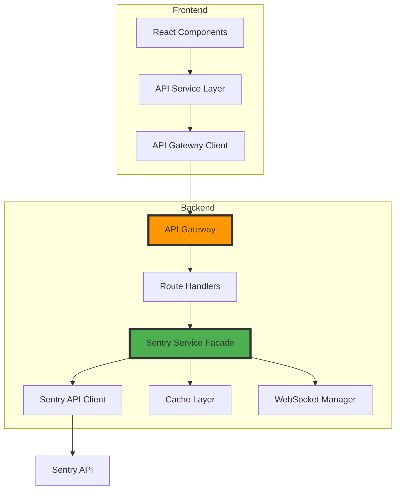

# Dexter API Optimization Solution Design

## Executive Summary

This solution design outlines a strategic approach to optimize and expand Dexter's integration with the Sentry API. The optimization will ensure complete API coverage, fix existing inconsistencies, and add missing critical features while maintaining backward compatibility with existing functionality.

## Current State Analysis

### API Coverage Metrics
- **Sentry API Endpoints Available**: ~50+ endpoints
- **Currently Utilized**: ~7 endpoints (14%)
- **Frontend Declarations vs Backend Implementation**: 60% mismatch
- **Critical Missing Features**: Issue assignment, bulk operations, alert rules, Discover API

### Architectural Assessment
```
Current Flow: Frontend → Backend → Sentry API
Issues:
- Inconsistent API paths
- Missing error boundaries
- No caching strategy
- Limited real-time capabilities
```

## Solution Architecture

### 1. API Gateway Pattern
Implement a unified API gateway layer to standardize all Sentry API interactions:



### 2. Service Facade Pattern
Create a facade layer to abstract Sentry API complexity:

```python
class SentryServiceFacade:
    def __init__(self, sentry_client, cache_service):
        self.sentry = sentry_client
        self.cache = cache_service
    
    async def get_issue_with_context(self, issue_id: str):
        # Combine multiple API calls
        issue = await self.sentry.get_issue(issue_id)
        events = await self.sentry.get_issue_events(issue_id)
        stats = await self.sentry.get_issue_stats(issue_id)
        
        return {
            **issue,
            "events": events,
            "stats": stats,
            "cached_at": datetime.utcnow()
        }
```

### 3. Configuration Management
Centralized configuration for API endpoints:

```yaml
# config/api-mappings.yaml
api_mappings:
  issues:
    list:
      frontend_path: "/api/v1/issues"
      backend_path: "/organizations/{org}/projects/{project}/issues"
      sentry_path: "/api/0/projects/{org}/{project}/issues/"
    detail:
      frontend_path: "/api/v1/issues/{id}"
      backend_path: "/organizations/{org}/issues/{id}"
      sentry_path: "/api/0/issues/{id}/"
```

## Implementation Strategy

### Phase 1: Foundation (Week 1-2)

#### 1.1 API Standardization
- Create unified API path configuration
- Implement path template resolution
- Add request/response interceptors

#### 1.2 Error Handling Framework
```typescript
// Centralized error handling
export const createApiErrorHandler = (context: string) => {
  return (error: any) => {
    const errorInfo = {
      context,
      status: error.response?.status,
      message: error.message,
      timestamp: new Date().toISOString()
    };
    
    // Log to monitoring service
    logger.error(errorInfo);
    
    // User-friendly error
    throw new ApiError(errorInfo);
  };
};
```

#### 1.3 Type Safety Enhancement
```typescript
// Generated from OpenAPI spec
export interface SentryIssue {
  id: string;
  title: string;
  status: 'resolved' | 'unresolved' | 'ignored';
  // ... complete typing
}
```

### Phase 2: Core Features (Week 3-4)

#### 2.1 Complete Missing Endpoints
Priority order:
1. Issue assignment and management
2. Bulk operations
3. Tag management
4. Comment system (if supported by Sentry)

#### 2.2 Caching Strategy
```python
class CacheService:
    def __init__(self, redis_client):
        self.redis = redis_client
        self.ttl = {
            'issues': 300,  # 5 minutes
            'events': 60,   # 1 minute
            'stats': 600    # 10 minutes
        }
    
    async def get_or_fetch(self, key: str, fetcher: Callable):
        cached = await self.redis.get(key)
        if cached:
            return json.loads(cached)
        
        data = await fetcher()
        await self.redis.setex(key, self.ttl.get(key, 300), json.dumps(data))
        return data
```

#### 2.3 Batch Processing
```typescript
// Frontend batch processor
export class BatchProcessor {
  private queue: BatchOperation[] = [];
  private processing = false;
  
  async add(operation: BatchOperation) {
    this.queue.push(operation);
    if (!this.processing) {
      this.process();
    }
  }
  
  private async process() {
    this.processing = true;
    while (this.queue.length > 0) {
      const batch = this.queue.splice(0, 10);
      await this.executeBatch(batch);
    }
    this.processing = false;
  }
}
```

### Phase 3: Advanced Features (Week 5-6)

#### 3.1 Alert Rules Integration
```typescript
interface AlertRule {
  id: string;
  name: string;
  conditions: Condition[];
  actions: Action[];
  frequency: number;
}

// Alert rule builder
export const AlertRuleBuilder = () => {
  const [rule, setRule] = useState<Partial<AlertRule>>({});
  
  return (
    <div>
      <ConditionEditor 
        conditions={rule.conditions} 
        onChange={(conditions) => setRule({...rule, conditions})}
      />
      <ActionEditor
        actions={rule.actions}
        onChange={(actions) => setRule({...rule, actions})}
      />
    </div>
  );
};
```

#### 3.2 Discover API Integration
```python
class DiscoverService:
    async def execute_query(self, query: DiscoverQuery):
        # Transform to Sentry format
        sentry_query = self.transform_query(query)
        
        # Execute with pagination
        results = []
        cursor = None
        
        while True:
            response = await self.sentry.discover_events(
                query=sentry_query,
                cursor=cursor
            )
            results.extend(response.data)
            
            if not response.next_cursor:
                break
            cursor = response.next_cursor
        
        return self.format_results(results)
```

#### 3.3 Real-time Updates
```typescript
// WebSocket connection manager
export class RealtimeManager {
  private ws: WebSocket | null = null;
  private subscribers: Map<string, Set<Subscriber>> = new Map();
  
  connect() {
    this.ws = new WebSocket(`${WS_URL}/events`);
    
    this.ws.onmessage = (event) => {
      const data = JSON.parse(event.data);
      this.notifySubscribers(data.type, data);
    };
  }
  
  subscribe(eventType: string, callback: Subscriber) {
    if (!this.subscribers.has(eventType)) {
      this.subscribers.set(eventType, new Set());
    }
    this.subscribers.get(eventType)!.add(callback);
  }
}
```

### Phase 4: Performance & Reliability (Week 7-8)

#### 4.1 Request Optimization
```typescript
// Request deduplication
class RequestDeduplicator {
  private pending = new Map<string, Promise<any>>();
  
  async deduplicate<T>(key: string, request: () => Promise<T>): Promise<T> {
    if (this.pending.has(key)) {
      return this.pending.get(key);
    }
    
    const promise = request().finally(() => {
      this.pending.delete(key);
    });
    
    this.pending.set(key, promise);
    return promise;
  }
}
```

#### 4.2 Resilience Patterns
```python
# Circuit breaker implementation
class CircuitBreaker:
    def __init__(self, failure_threshold=5, recovery_timeout=60):
        self.failure_count = 0
        self.failure_threshold = failure_threshold
        self.recovery_timeout = recovery_timeout
        self.last_failure_time = None
        self.state = 'CLOSED'
    
    async def call(self, func, *args, **kwargs):
        if self.state == 'OPEN':
            if self._should_attempt_reset():
                self.state = 'HALF_OPEN'
            else:
                raise CircuitOpenError()
        
        try:
            result = await func(*args, **kwargs)
            self._on_success()
            return result
        except Exception as e:
            self._on_failure()
            raise
```

## Testing Strategy

### 1. Unit Testing
```typescript
describe('SentryApiClient', () => {
  it('should handle pagination correctly', async () => {
    const mockApi = new MockSentryApi();
    const client = new SentryApiClient(mockApi);
    
    const results = await client.getAllIssues({ limit: 100 });
    
    expect(mockApi.calls).toEqual([
      { endpoint: '/issues', params: { cursor: null, limit: 100 } },
      { endpoint: '/issues', params: { cursor: 'next-cursor', limit: 100 } }
    ]);
  });
});
```

### 2. Integration Testing
```python
@pytest.mark.asyncio
async def test_issue_lifecycle():
    # Create issue
    issue = await api.create_issue(test_data)
    
    # Update status
    updated = await api.update_issue_status(issue.id, 'resolved')
    assert updated.status == 'resolved'
    
    # Verify in list
    issues = await api.list_issues(status='resolved')
    assert any(i.id == issue.id for i in issues)
```

### 3. Performance Testing
```typescript
// Load testing
describe('Performance', () => {
  it('should handle concurrent requests', async () => {
    const promises = Array(100).fill(null).map(() => 
      api.fetchIssues({ limit: 50 })
    );
    
    const start = Date.now();
    await Promise.all(promises);
    const duration = Date.now() - start;
    
    expect(duration).toBeLessThan(5000); // 5 seconds max
  });
});
```

## Monitoring & Observability

### 1. Metrics Collection
```python
# API metrics
class ApiMetrics:
    def __init__(self, prometheus_client):
        self.client = prometheus_client
        
        self.request_duration = Histogram(
            'api_request_duration_seconds',
            'API request duration',
            ['method', 'endpoint', 'status']
        )
        
        self.request_count = Counter(
            'api_request_total',
            'Total API requests',
            ['method', 'endpoint', 'status']
        )
```

### 2. Distributed Tracing
```typescript
// OpenTelemetry integration
import { trace } from '@opentelemetry/api';

export const tracedApiCall = async (name: string, fn: Function) => {
  const span = trace.getTracer('dexter').startSpan(name);
  
  try {
    const result = await fn();
    span.setStatus({ code: SpanStatusCode.OK });
    return result;
  } catch (error) {
    span.setStatus({ code: SpanStatusCode.ERROR });
    span.recordException(error);
    throw error;
  } finally {
    span.end();
  }
};
```

## Migration Strategy

### 1. Backward Compatibility
- Maintain existing API endpoints
- Add versioning headers
- Gradual migration with feature flags

### 2. Data Migration
```sql
-- Add new fields while maintaining old ones
ALTER TABLE issue_cache ADD COLUMN api_version VARCHAR(10) DEFAULT 'v1';
ALTER TABLE issue_cache ADD COLUMN enhanced_data JSONB;
```

### 3. Rollout Plan
1. Deploy new backend with feature flags
2. Update frontend to use new endpoints (gated)
3. Gradual user rollout (10% → 50% → 100%)
4. Monitor metrics and errors
5. Complete migration and cleanup

## Success Metrics

### Technical Metrics
- API response time < 200ms (p95)
- Error rate < 0.1%
- Cache hit ratio > 80%
- API coverage > 90%

### Business Metrics
- User engagement +25%
- Error resolution time -30%
- Feature adoption rate > 60%
- User satisfaction score > 4.5/5

## Risk Mitigation

### Technical Risks
1. **Sentry API Changes**
   - Mitigation: Version detection, graceful degradation
   
2. **Performance Degradation**
   - Mitigation: Caching, request optimization, monitoring

3. **Data Inconsistency**
   - Mitigation: Transaction management, eventual consistency patterns

### Operational Risks
1. **Migration Failures**
   - Mitigation: Rollback procedures, canary deployments
   
2. **User Disruption**
   - Mitigation: Feature flags, gradual rollout

## Conclusion

This solution design provides a comprehensive approach to optimizing Dexter's Sentry API integration. The phased implementation ensures minimal disruption while maximizing feature delivery and performance improvements. The focus on maintainability, observability, and user experience will position Dexter as a superior Sentry companion tool.
