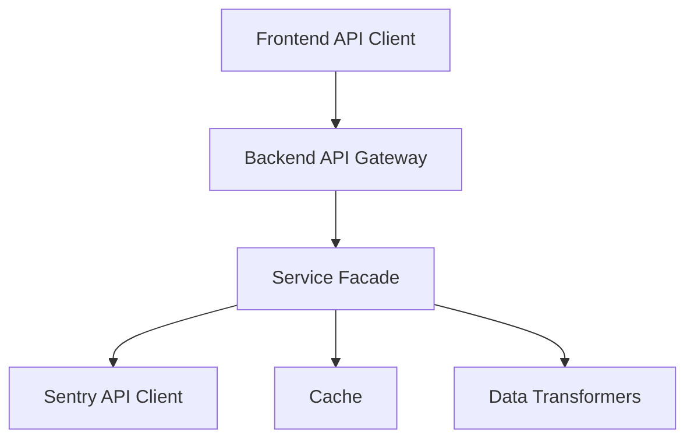

# Dexter API Reference

This document provides a comprehensive guide to the new Dexter API structure. It covers the backend and frontend implementation, configuration patterns, and best practices for extending the API.

## API Architecture Overview

The Dexter API is designed as a facade over the Sentry API, providing additional functionality and a more consistent interface. The architecture follows a layered approach:



## API Configuration

All API endpoints are defined in YAML configuration files, which provide a single source of truth for both backend and frontend implementations.

### Configuration Structure

```yaml
# Example configuration structure
issues:
  list:
    frontend_path: "/api/v1/issues"
    backend_path: "/organizations/{org}/projects/{project}/issues"
    sentry_path: "/api/0/projects/{org}/{project}/issues/"
    query_params:
      - status
      - limit
      - cursor
    description: "List issues for a project"
```

### Configuration Location

- **Backend**: `app/config/api_mappings.yaml`
- **Frontend**: Shared through API configuration endpoint

## Backend Implementation

### ApiConfigService

The `ApiConfigService` is responsible for loading and managing API configurations. It provides methods for resolving paths based on the endpoint key and parameters.

```python
from app.services.api_config_service import ApiConfigService

# Example usage
api_config = ApiConfigService()
path = api_config.resolve_path("issues.list", {"org": "my-org", "project": "my-project"})
```

### SentryApiClient

The `SentryApiClient` is a wrapper around the Sentry API, providing a consistent interface and handling authentication, rate limiting, and error handling.

```python
from app.services.sentry_api_client import SentryApiClient

# Example usage
sentry_client = SentryApiClient()
issues = await sentry_client.get_issues("my-org", "my-project", status="unresolved")
```

### Service Facade

The service facade layer abstracts the Sentry API complexity and provides additional functionality like caching, batch processing, and data transformation.

```python
from app.services.sentry_service_facade import SentryServiceFacade

# Example usage
service = SentryServiceFacade(sentry_client, cache_service)
issue_with_context = await service.get_issue_with_context("my-org", "issue-id")
```

## Frontend Implementation

### API Client Structure

The frontend API client is structured in a modular way, with specialized modules for each API area:

```
src/
├── api/
│   ├── client.js          # Core API client
│   ├── config.js          # API configuration
│   ├── issues.js          # Issues API
│   ├── events.js          # Events API
│   ├── discover.js        # Discover API
│   └── alertRules.js      # Alert Rules API
```

### Core API Client

The core client handles common functionality like authentication, error handling, and request formatting:

```javascript
// Example core client
import { ApiClient } from './client';

const client = new ApiClient({
  baseUrl: '/api',
  defaultHeaders: {
    'Content-Type': 'application/json'
  }
});

export default client;
```

### Specialized API Modules

Each API area has a specialized module:

```javascript
// Example issues API module
import client from './client';
import { resolveApiPath } from './config';

export const IssuesApi = {
  async getIssues(org, project, params) {
    const path = resolveApiPath('issues.list', { org, project });
    return client.get(path, { params });
  },
  
  async getIssueDetails(org, issueId) {
    const path = resolveApiPath('issues.detail', { org, id: issueId });
    return client.get(path);
  },
  
  async updateIssue(org, issueId, data) {
    const path = resolveApiPath('issues.update', { org, id: issueId });
    return client.put(path, data);
  }
};
```

## Path Resolution

The path resolution system is a key component of the API architecture, allowing for consistent path handling across backend and frontend.

### Backend Path Resolution

```python
def resolve_path(self, endpoint_key: str, path_params: Dict[str, str] = None) -> str:
    """Resolve an API path based on the endpoint key and parameters."""
    path_params = path_params or {}
    
    # Get endpoint config
    category, endpoint = endpoint_key.split(".")
    if category not in self.config:
        raise ValueError(f"Unknown API category: {category}")
    if endpoint not in self.config[category]:
        raise ValueError(f"Unknown API endpoint: {endpoint}")
    
    endpoint_config = self.config[category][endpoint]
    path_template = endpoint_config.get("backend_path")
    
    # Validate required parameters
    required_params = self._extract_path_params(path_template)
    for param in required_params:
        if param not in path_params:
            raise ValueError(f"Missing required path parameter: {param}")
    
    # Replace parameters in template
    path = path_template
    for key, value in path_params.items():
        placeholder = f"{{{key}}}"
        if placeholder in path:
            path = path.replace(placeholder, value)
    
    return path
```

### Frontend Path Resolution

```javascript
export function resolveApiPath(endpointKey, pathParams = {}) {
  // Split the endpoint key into category and endpoint
  const [category, endpoint] = endpointKey.split('.');
  
  // Get the endpoint configuration
  const config = apiConfig[category]?.[endpoint];
  if (!config) {
    throw new Error(`Unknown API endpoint: ${endpointKey}`);
  }
  
  // Get the path template
  const pathTemplate = config.frontend_path;
  
  // Replace parameters in template
  let path = pathTemplate;
  for (const [key, value] of Object.entries(pathParams)) {
    const placeholder = `{${key}}`;
    if (path.includes(placeholder)) {
      path = path.replace(placeholder, encodeURIComponent(value));
    }
  }
  
  return path;
}
```

## Error Handling

### Backend Error Handling

```python
class ApiError(Exception):
    """API error with detailed information."""
    
    def __init__(self, message, status_code=None, details=None):
        self.message = message
        self.status_code = status_code
        self.details = details
        super().__init__(message)

# Usage in routes
@router.get("/issues")
async def get_issues(request: Request):
    try:
        # API call...
    except ApiError as e:
        return JSONResponse(
            status_code=e.status_code or 500,
            content={"error": e.message, "details": e.details}
        )
```

### Frontend Error Handling

```javascript
// Centralized error handling
export const createApiErrorHandler = (context) => {
  return (error) => {
    const errorInfo = {
      context,
      status: error.response?.status,
      message: error.message || 'Unknown error',
      timestamp: new Date().toISOString()
    };
    
    // Log to monitoring service
    logger.error(errorInfo);
    
    // Show user-friendly notification
    notificationService.showError(
      error.response?.data?.message || 'An error occurred'
    );
    
    // Throw for component error boundaries
    throw new ApiError(errorInfo);
  };
};
```

## Caching Strategy

The API implements a multi-level caching strategy:

### Backend Caching

```python
class CacheService:
    def __init__(self, redis_client):
        self.redis = redis_client
        self.ttl = {
            'issues': 300,  # 5 minutes
            'events': 60,   # 1 minute
            'stats': 600    # 10 minutes
        }
    
    async def get_or_fetch(self, key: str, fetcher: Callable):
        cached = await self.redis.get(key)
        if cached:
            return json.loads(cached)
        
        data = await fetcher()
        await self.redis.setex(key, self.ttl.get(key, 300), json.dumps(data))
        return data
```

### Frontend Caching

```javascript
// Using React Query for frontend caching
const useIssuesList = (org, project, filters) => {
  return useQuery({
    queryKey: ['issues', org, project, filters],
    queryFn: () => IssuesApi.getIssues(org, project, filters),
    staleTime: 30000, // 30 seconds
    cacheTime: 300000, // 5 minutes
    retry: 2
  });
};
```

## Adding New Endpoints

To add a new endpoint to the API:

1. Add the endpoint configuration to `api_mappings.yaml`:

```yaml
# Example new endpoint
alert_rules:
  create:
    frontend_path: "/api/v1/organizations/{org}/projects/{project}/alert-rules"
    backend_path: "/organizations/{org}/projects/{project}/alert-rules"
    sentry_path: "/api/0/projects/{org}/{project}/rules/"
    method: "POST"
    description: "Create a new alert rule"
```

2. Add the backend implementation in the appropriate router:

```python
@router.post("/organizations/{org}/projects/{project}/alert-rules")
async def create_alert_rule(org: str, project: str, rule: AlertRuleCreate):
    """Create a new alert rule."""
    api_path = api_config.resolve_sentry_path("alert_rules.create", {
        "org": org,
        "project": project
    })
    
    # Transform to Sentry format
    sentry_rule = transform_to_sentry_format(rule)
    
    # Make API call
    response = await sentry_client.post(api_path, sentry_rule)
    
    # Transform response
    return transform_from_sentry_format(response)
```

3. Add the frontend implementation in the appropriate API module:

```javascript
export const AlertRulesApi = {
  // ...
  
  async createAlertRule(org, project, rule) {
    const path = resolveApiPath('alert_rules.create', { org, project });
    return client.post(path, rule);
  }
};
```

## Best Practices

### API Usage

1. **Always use endpoint keys**: Use endpoint keys from the config for path resolution.
2. **Handle errors consistently**: Wrap API calls in try/catch blocks with proper error handling.
3. **Use proper caching**: Set appropriate cache TTLs based on data volatility.
4. **Use batch operations**: Use bulk endpoints for multiple operations.

### Extending the API

1. **Add to config first**: Always start by adding the endpoint to the configuration.
2. **Test thoroughly**: Add tests for each new endpoint.
3. **Validate parameters**: Ensure all required parameters are validated.
4. **Document endpoints**: Update the API reference with new endpoints.

### Migration Tips

1. **Use feature flags**: When adding significant changes, use feature flags for gradual rollout.
2. **Backward compatibility**: Maintain backward compatibility with existing code.
3. **Test both paths**: Test both old and new implementations during migration.

## Testing

### Backend Testing

```python
async def test_issue_endpoint():
    """Test the issue endpoint with mocked responses."""
    # Setup mocked client
    mock_client = MockSentryClient()
    mock_client.add_response(
        "GET", "/api/0/issues/12345/",
        data={"id": "12345", "title": "Test Issue"}
    )
    
    # Initialize service with mock
    service = SentryServiceFacade(mock_client, MockCacheService())
    
    # Test the endpoint
    issue = await service.get_issue("test-org", "12345")
    
    assert issue["id"] == "12345"
    assert issue["title"] == "Test Issue"
```

### Frontend Testing

```javascript
describe('IssuesApi', () => {
  beforeEach(() => {
    jest.spyOn(client, 'get').mockImplementation(() => Promise.resolve({
      data: [{ id: '12345', title: 'Test Issue' }]
    }));
  });
  
  it('should get issues list', async () => {
    const result = await IssuesApi.getIssues('test-org', 'test-project');
    
    expect(client.get).toHaveBeenCalledWith(
      '/api/v1/issues',
      { params: { org: 'test-org', project: 'test-project' } }
    );
    expect(result.data).toEqual([{ id: '12345', title: 'Test Issue' }]);
  });
});
```

## Troubleshooting

### Common Issues

1. **Path resolution errors**:
   - Check that all required parameters are provided
   - Verify the endpoint key is correct
   - Check for typos in parameter names

2. **Missing configuration**:
   - Ensure the endpoint is defined in the configuration file
   - Verify that configuration is loaded correctly

3. **API versioning conflicts**:
   - Check that frontend and backend are using the same API version
   - Verify that compatibility layers are in place during migration

### Debugging Tools

1. **API request logging**:
   - Enable debug logging for API requests
   - Check request/response details in logs

2. **Configuration validation**:
   - Use the API configuration validation endpoint
   - Verify configuration syntax with schema validation

3. **Path resolution testing**:
   - Use the path resolution test utility
   - Manually test paths with the API explorer

## Conclusion

This reference provides a comprehensive guide to the Dexter API structure. By following these patterns and best practices, developers can efficiently work with and extend the API while maintaining consistency and reliability.
