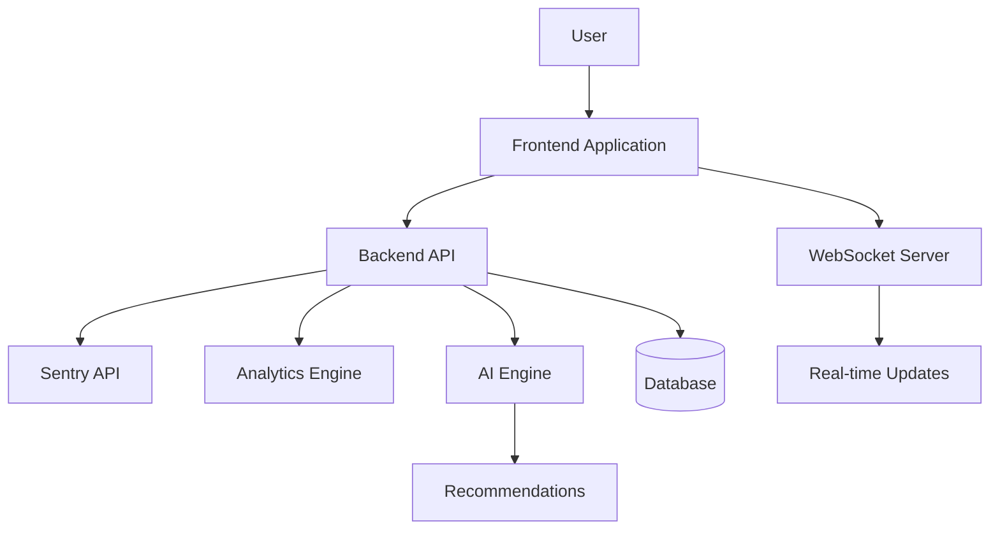
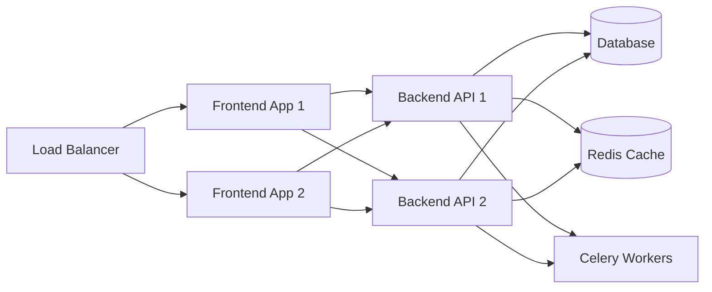

# Dexter System Architecture

## Overview

This document provides a comprehensive overview of the Dexter system architecture, consolidating information from multiple architectural documents into a single reference.

## Table of Contents

1. [System Components](#system-components)
2. [Data Flow](#data-flow)
3. [Frontend Architecture](#frontend-architecture)
4. [Backend Architecture](#backend-architecture)
5. [Integration with Sentry](#integration-with-sentry)
6. [API Design](#api-design)
7. [Data Models](#data-models)
8. [Performance Considerations](#performance-considerations)
9. [Deployment Architecture](#deployment-architecture)

## System Components

Dexter consists of the following major components:

1. **Frontend Application**: React-based SPA with TypeScript
2. **Backend API**: Python FastAPI application
3. **Sentry Integration**: Connectors and data processors for Sentry API
4. **Analytics Engine**: Data processing and insights generation
5. **Real-time Update System**: WebSocket-based notification system
6. **AI Components**: Recommendation and analysis systems

### High-Level Architecture Diagram



## Data Flow

The main data flows through the system are:

1. **Issue Data Flow**:
   - Sentry API → Backend API → Data Processing → Frontend → User Interface

2. **Analytics Flow**:
   - Raw Event Data → Analytics Engine → Insights → Frontend → Visualization

3. **Deadlock Detection Flow**:
   - Event Stream → Detection Algorithm → Analysis → UI → Recommendations

4. **Real-time Updates**:
   - Events → WebSocket → Frontend Notification System → UI Updates

## Frontend Architecture

The frontend follows a modern React architecture:

### Core Technologies

- **React 18**: UI component library
- **TypeScript**: Type-safe JavaScript
- **Redux Toolkit**: State management
- **React Router**: Navigation
- **Mantine UI**: Component library
- **TanStack Query**: Data fetching and caching
- **D3.js**: Data visualization

### Architecture Patterns

The frontend adopts several architectural patterns:

1. **Atomic Design**: Components organized by complexity:
   - Atoms: Basic UI elements
   - Molecules: Combinations of atoms
   - Organisms: Complex components
   - Templates: Page layouts
   - Pages: Complete views

2. **Feature-based Organization**:
   ```
   /src
   ├── /components - Reusable UI components
   ├── /hooks - Custom React hooks
   ├── /pages - Page components
   ├── /api - API clients and utilities
   ├── /store - Redux state management
   ├── /utils - Utility functions
   ├── /types - TypeScript type definitions
   └── /features - Feature-specific code
   ```

3. **Container/Presentation Pattern**:
   - Container components handle data and state
   - Presentation components focus on UI rendering

## Backend Architecture

The backend is built with Python and follows these patterns:

### Core Technologies

- **FastAPI**: API framework
- **SQLAlchemy**: ORM for database interaction
- **Pydantic**: Data validation and serialization
- **Pytest**: Testing framework
- **Alembic**: Database migrations
- **Celery**: Task queue for background processing

### Architecture Patterns

1. **Domain-Driven Design**:
   - Entities represent core domain objects
   - Value objects for immutable values
   - Repositories abstract data access
   - Services implement business logic

2. **Repository Pattern**:
   - Abstract database operations
   - Provide domain-specific query methods
   - Enable testability through dependency injection

3. **Service Layer**:
   - Implement business logic
   - Coordinate between repositories
   - Provide transaction management

### API Design

The backend API follows RESTful principles with:

- Resource-based endpoints
- Standard HTTP methods
- Consistent response formats
- Proper status code usage
- JWT-based authentication

## Integration with Sentry

Dexter integrates deeply with Sentry:

### Data Integration

1. **Events API**: Fetches detailed event data
2. **Issues API**: Retrieves and updates issue information
3. **Organizations API**: Access to organization structure
4. **Projects API**: Project configuration and metadata

### Authentication Flow

Dexter uses OAuth2 for Sentry authentication:

1. User authorizes Dexter in Sentry
2. Sentry provides access tokens
3. Tokens are stored securely
4. API requests use tokens for authentication

### Data Processing

Sentry data goes through several processing stages:

1. **Normalization**: Converting to standard format
2. **Enrichment**: Adding derived data
3. **Analysis**: Detecting patterns and issues
4. **Storage**: Caching for performance

## API Design

### API Principles

The API follows these principles:

1. **RESTful Design**: Resource-based endpoints with appropriate HTTP methods
2. **Consistent Responses**: Standardized response format
3. **Error Handling**: Detailed error information
4. **Pagination**: Efficient handling of large datasets
5. **Filtering**: Flexible query parameters

### Key Endpoints

The main API areas are:

1. **Issues**: `/api/issues/`
   - List, retrieve, update issues

2. **Events**: `/api/events/`
   - Event details and metadata

3. **Analytics**: `/api/analytics/`
   - Statistical data and insights

4. **Deadlocks**: `/api/deadlocks/`
   - Deadlock detection and analysis

5. **Recommendations**: `/api/recommendations/`
   - AI-powered improvement suggestions

## Data Models

### Core Entities

1. **Issue**
   - Unique identifier
   - Title and description
   - Status and assignment
   - Related events
   - Tags and metadata

2. **Event**
   - Timestamp
   - Exception details
   - Context information
   - Environmental data
   - User information

3. **Deadlock**
   - Lock relationships
   - Involved resources
   - Acquisition sequence
   - Detection confidence
   - Recommended solutions

4. **Alert Rule**
   - Conditions
   - Actions
   - Notifications
   - Schedule
   - Status

## Performance Considerations

### Frontend Optimization

1. **Code Splitting**: Dynamic imports for route-based code splitting
2. **Memoization**: Careful use of React.memo and useMemo
3. **Virtual Lists**: Efficient rendering of large datasets
4. **Request Caching**: TanStack Query for efficient data fetching
5. **Web Workers**: Offloading heavy computation

### Backend Optimization

1. **Query Optimization**: Efficient database access
2. **Caching**: Redis-based response caching
3. **Asynchronous Processing**: Background tasks for intensive operations
4. **Connection Pooling**: Optimized database connections
5. **Rate Limiting**: Protection against API abuse

## Deployment Architecture

### Production Environment

The system is deployed using containerization:



### Scaling Strategy

The system scales horizontally with:

1. **Frontend**: Multiple instances behind load balancer
2. **Backend API**: Stateless design for easy scaling
3. **Database**: Read replicas and connection pooling
4. **Caching**: Distributed Redis cache
5. **Background Processing**: Scaled Celery workers
