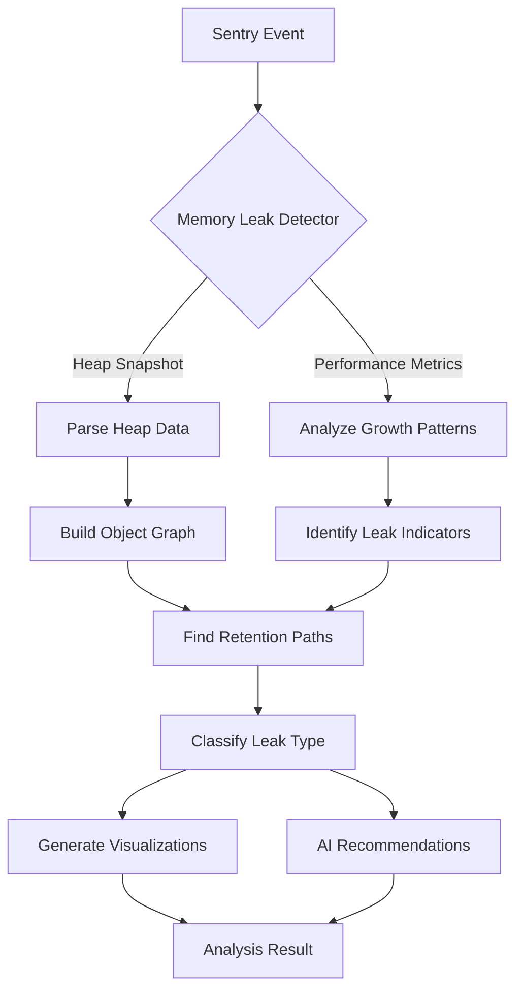

# Enterprise-Grade Memory Leak Analyzer - Solution Design

## Executive Summary

The Memory Leak Analyzer is an enterprise-grade plugin for the Dexter analyzer framework that detects, analyzes, and provides actionable insights for JavaScript/TypeScript memory leaks in production applications. It supports multiple JavaScript runtimes (Node.js, Browser, React Native) and provides visualization of memory growth patterns, object retention graphs, and AI-powered remediation strategies.

## 1. Business Requirements

### 1.1 Objectives
- Detect memory leaks in production JavaScript applications
- Provide actionable insights to reduce memory-related incidents by 80%
- Support enterprise JavaScript frameworks (React, Vue, Angular, Node.js)
- Enable proactive memory management through early detection
- Reduce MTTR (Mean Time To Resolution) for memory issues

### 1.2 Success Criteria
- Detection accuracy > 95% for common memory leak patterns
- Analysis completion < 5 seconds for typical heap snapshots
- Support for heap snapshots up to 1GB
- Integration with major APM tools (Datadog, New Relic, AppDynamics)
- ROI through reduced infrastructure costs and improved application stability

## 2. Technical Architecture

### 2.1 Component Overview

```
┌─────────────────────────────────────────────────────────────────┐
│                     Memory Leak Analyzer                         │
├─────────────────────────────────────────────────────────────────┤
│  Detection Layer                                                 │
│  ├── Heap Snapshot Parser (V8, JSC, SpiderMonkey)              │
│  ├── Memory Growth Detector                                     │
│  └── Pattern Recognition Engine                                 │
├─────────────────────────────────────────────────────────────────┤
│  Analysis Layer                                                  │
│  ├── Retention Path Analyzer                                    │
│  ├── Object Allocation Tracker                                  │
│  ├── Garbage Collection Analyzer                                │
│  └── Framework-Specific Analyzers                              │
├─────────────────────────────────────────────────────────────────┤
│  Intelligence Layer                                              │
│  ├── ML-Based Leak Classification                              │
│  ├── Pattern Learning Engine                                    │
│  └── AI Recommendation Generator                               │
├─────────────────────────────────────────────────────────────────┤
│  Visualization Layer                                             │
│  ├── Memory Timeline Graph                                      │
│  ├── Retention Tree Visualization                              │
│  ├── Heap Comparison View                                      │
│  └── Interactive Object Explorer                               │
└─────────────────────────────────────────────────────────────────┘
```

### 2.2 Data Flow



### 2.3 Core Components

#### 2.3.1 Heap Snapshot Parser
```python
class HeapSnapshotParser:
    """
    Parses heap snapshots from various JavaScript engines.
    Supports V8 (Chrome/Node.js), JavaScriptCore (Safari), SpiderMonkey (Firefox).
    """
    
    def parse_v8_snapshot(self, snapshot_data: bytes) -> HeapGraph
    def parse_jsc_snapshot(self, snapshot_data: bytes) -> HeapGraph
    def parse_spidermonkey_snapshot(self, snapshot_data: bytes) -> HeapGraph
    def extract_memory_metrics(self) -> MemoryMetrics
```

#### 2.3.2 Memory Growth Detector
```python
class MemoryGrowthDetector:
    """
    Detects abnormal memory growth patterns using statistical analysis.
    """
    
    def analyze_time_series(self, metrics: List[MemoryMetric]) -> GrowthPattern
    def detect_leak_probability(self, pattern: GrowthPattern) -> float
    def classify_growth_type(self) -> GrowthType  # LINEAR, EXPONENTIAL, STEPPED
```

#### 2.3.3 Retention Path Analyzer
```python
class RetentionPathAnalyzer:
    """
    Analyzes object retention paths to identify leak sources.
    """
    
    def find_gc_roots(self, object_id: str) -> List[GCRoot]
    def calculate_retained_size(self, object_id: str) -> int
    def find_shortest_retention_path(self, object_id: str) -> RetentionPath
    def identify_leak_clusters(self) -> List[LeakCluster]
```

## 3. Memory Leak Patterns

### 3.1 Detectable Patterns

1. **DOM Detached Nodes**
   - Orphaned DOM elements with event listeners
   - Detached DOM trees in closures
   - jQuery memory leaks

2. **Event Listener Leaks**
   - Unremoved event listeners
   - Circular references through event handlers
   - EventEmitter leaks in Node.js

3. **Closure Leaks**
   - Accidental closure captures
   - Timer/interval closures
   - Promise chain leaks

4. **Framework-Specific Leaks**
   - React: Unmounted component state updates
   - Vue: Unreleased watchers and computed properties
   - Angular: Unsubscribed observables

5. **Global Variable Pollution**
   - Accidental globals
   - Cache without eviction
   - Module-level state accumulation

### 3.2 Pattern Recognition Engine

```python
class PatternRecognitionEngine:
    """
    ML-based pattern recognition for memory leak detection.
    """
    
    patterns = {
        "detached_dom": DetachedDOMPattern(),
        "event_listener": EventListenerPattern(),
        "closure_leak": ClosureLeakPattern(),
        "react_leak": ReactMemoryLeakPattern(),
        "vue_leak": VueMemoryLeakPattern(),
        "angular_leak": AngularMemoryLeakPattern(),
        "global_pollution": GlobalPollutionPattern(),
        "circular_reference": CircularReferencePattern(),
        "timer_leak": TimerLeakPattern(),
        "promise_leak": PromiseLeakPattern()
    }
    
    def match_patterns(self, heap_analysis: HeapAnalysis) -> List[LeakPattern]
    def calculate_confidence(self, pattern: LeakPattern) -> float
    def learn_new_pattern(self, confirmed_leak: ConfirmedLeak) -> None
```

## 4. Enterprise Features

### 4.1 Multi-Tenant Support
```python
class TenantIsolation:
    """
    Ensures complete isolation of memory analysis data between tenants.
    """
    
    def create_tenant_context(self, tenant_id: str) -> TenantContext
    def isolate_heap_data(self, heap: HeapGraph, tenant: TenantContext) -> IsolatedHeap
    def apply_tenant_policies(self, analysis: AnalysisResult) -> FilteredResult
```

### 4.2 Scalability
- Distributed heap analysis using worker pools
- Streaming parser for large heap snapshots
- Incremental analysis for continuous monitoring
- Result caching with TTL based on heap size

### 4.3 Security & Compliance
```python
class SecurityManager:
    """
    Handles security and compliance requirements.
    """
    
    def redact_sensitive_data(self, heap: HeapGraph) -> RedactedHeap
    def apply_gdpr_compliance(self, analysis: AnalysisResult) -> CompliantResult
    def audit_log_access(self, user: User, data: HeapData) -> None
    def encrypt_heap_snapshot(self, snapshot: bytes) -> EncryptedSnapshot
```

### 4.4 Integration Points

1. **APM Integration**
   ```python
   class APMIntegration:
       def sync_with_datadog(self, leak_data: LeakAnalysis) -> None
       def export_to_new_relic(self, metrics: MemoryMetrics) -> None
       def send_to_app_dynamics(self, alert: MemoryAlert) -> None
   ```

2. **CI/CD Integration**
   ```python
   class CICDIntegration:
       def analyze_pr_memory_impact(self, pr_id: str) -> MemoryImpactReport
       def gate_deployment(self, analysis: PreDeployAnalysis) -> bool
       def generate_memory_report(self) -> MemoryHealthReport
   ```

3. **Alerting Integration**
   ```python
   class AlertingIntegration:
       def create_pagerduty_incident(self, leak: CriticalLeak) -> None
       def send_slack_notification(self, summary: LeakSummary) -> None
       def update_jira_ticket(self, leak: LeakAnalysis) -> None
   ```

## 5. Visualization Components

### 5.1 Memory Timeline Graph
```typescript
interface MemoryTimelineProps {
  data: MemoryMetric[];
  leakIndicators: LeakIndicator[];
  gcEvents: GCEvent[];
  annotations: Annotation[];
}

// Interactive timeline showing memory growth with leak indicators
```

### 5.2 Retention Tree Visualization
```typescript
interface RetentionTreeProps {
  rootObject: HeapObject;
  retentionPaths: RetentionPath[];
  interactionMode: 'explore' | 'compare' | 'analyze';
}

// D3.js-based tree visualization of object retention
```

### 5.3 Heap Comparison View
```typescript
interface HeapComparisonProps {
  beforeSnapshot: HeapSnapshot;
  afterSnapshot: HeapSnapshot;
  deltaHighlight: boolean;
  filterOptions: FilterOptions;
}

// Side-by-side comparison with delta analysis
```

## 6. AI-Powered Recommendations

### 6.1 Recommendation Engine
```python
class MemoryLeakRecommendationEngine:
    """
    Generates context-aware recommendations using LLM and historical data.
    """
    
    def generate_fix_recommendation(self, leak: LeakAnalysis) -> Recommendation
    def suggest_preventive_measures(self, pattern: LeakPattern) -> List[Prevention]
    def create_code_fix(self, leak_context: LeakContext) -> CodeFix
    def estimate_memory_savings(self, fix: CodeFix) -> MemorySavings
```

### 6.2 Learning System
```python
class LeakLearningSystem:
    """
    Learns from resolved leaks to improve future recommendations.
    """
    
    def record_fix_outcome(self, leak: LeakAnalysis, fix: AppliedFix) -> None
    def update_pattern_weights(self, feedback: UserFeedback) -> None
    def generate_leak_insights(self, project: Project) -> LeakInsights
```

## 7. Performance Specifications

### 7.1 Processing Capabilities
- Heap snapshot parsing: < 100ms per MB
- Pattern matching: < 500ms for standard patterns
- Visualization generation: < 2s for complex graphs
- AI recommendation: < 3s per leak

### 7.2 Resource Requirements
- Memory: 2x heap snapshot size (streaming mode: 200MB constant)
- CPU: 4 cores for parallel analysis
- Storage: 10x compressed snapshot size for historical data

### 7.3 Scaling Metrics
- Horizontal scaling: Up to 100 parallel analyses
- Vertical scaling: Heap snapshots up to 4GB
- Throughput: 1000 analyses per minute per node

## 8. Implementation Phases

### Phase 1: Core Detection (4 weeks)
- Basic heap snapshot parsing (V8 only)
- Simple memory growth detection
- Basic leak pattern matching
- MVP visualization

### Phase 2: Advanced Analysis (6 weeks)
- Multi-engine support (JSC, SpiderMonkey)
- Complex pattern recognition
- Retention path analysis
- Enhanced visualizations

### Phase 3: Intelligence Layer (4 weeks)
- ML-based classification
- AI recommendation engine
- Learning system implementation
- Advanced code fix generation

### Phase 4: Enterprise Features (6 weeks)
- Multi-tenant support
- APM integrations
- Security & compliance
- Performance optimization

### Phase 5: Production Hardening (4 weeks)
- Stress testing
- Performance tuning
- Documentation
- Training materials

## 9. Testing Strategy

### 9.1 Test Scenarios
1. **Synthetic Leak Tests**
   - Known leak patterns with ground truth
   - Performance regression tests
   - Edge cases (empty heaps, corrupted data)

2. **Real-World Tests**
   - Production heap snapshots (anonymized)
   - Framework-specific test suites
   - Cross-browser compatibility

3. **Integration Tests**
   - End-to-end analyzer flow
   - API compatibility
   - Visualization rendering

### 9.2 Performance Benchmarks
- Parse 100MB heap snapshot: < 10s
- Analyze 1000 objects: < 1s
- Generate visualization: < 2s
- Complete analysis: < 30s

## 10. Success Metrics

### 10.1 Technical Metrics
- Detection accuracy: > 95%
- False positive rate: < 5%
- Analysis speed: < 30s for 95th percentile
- Uptime: 99.9%

### 10.2 Business Metrics
- Memory incidents reduced: 80%
- MTTR improvement: 60%
- Developer productivity: 40% faster leak resolution
- Infrastructure cost savings: 30% through optimized memory usage

## 11. Risk Mitigation

### 11.1 Technical Risks
- **Large heap snapshots**: Implement streaming parser
- **Complex object graphs**: Use graph sampling techniques
- **Performance impact**: Implement caching and incremental analysis
- **Framework changes**: Maintain framework adapters

### 11.2 Business Risks
- **Adoption resistance**: Provide clear ROI metrics
- **Training needs**: Create comprehensive documentation
- **Integration complexity**: Offer professional services
- **Data privacy**: Implement strict data handling policies

## 12. Future Enhancements

### 12.1 Roadmap
- WebAssembly memory leak detection
- Real-time memory profiling
- Predictive leak detection
- Automated fix application
- Memory optimization recommendations

### 12.2 Research Areas
- Graph neural networks for pattern detection
- Automated heap snapshot generation
- Cross-language memory analysis
- Quantum algorithms for graph analysis