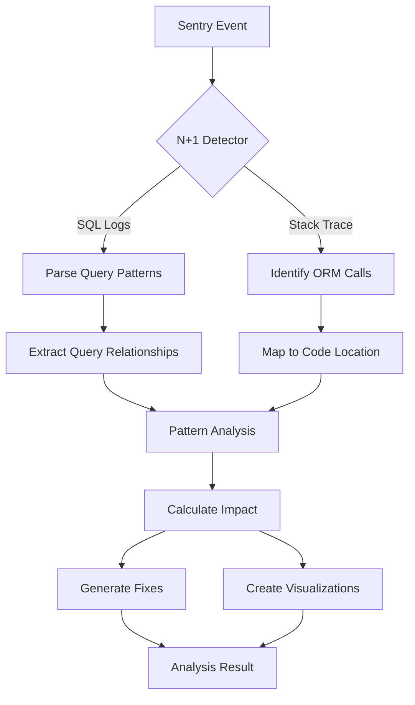

# Enterprise-Grade N+1 Query Analyzer - Solution Design

## Executive Summary

The N+1 Query Analyzer is an enterprise-grade plugin for the Dexter analyzer framework that detects, analyzes, and provides solutions for N+1 query problems in production applications. It supports multiple ORMs (Django, SQLAlchemy, ActiveRecord, Sequelize, TypeORM, Prisma), provides real-time query pattern analysis, and offers AI-powered optimization strategies with automated fix generation.

## 1. Business Requirements

### 1.1 Objectives
- Detect N+1 query patterns across all major ORMs and databases
- Reduce database load and improve application performance by 70%
- Provide automated fix suggestions with confidence scoring
- Enable proactive performance optimization through continuous monitoring
- Support enterprise-scale applications with millions of queries/day

### 1.2 Success Criteria
- Detection accuracy > 98% for standard N+1 patterns
- Analysis latency < 100ms per query batch
- Support for 10+ ORMs and 5+ database engines
- Automated fix generation with > 90% correctness
- ROI through reduced database costs and improved response times

## 2. Technical Architecture

### 2.1 Component Overview

```
┌─────────────────────────────────────────────────────────────────┐
│                      N+1 Query Analyzer                          │
├─────────────────────────────────────────────────────────────────┤
│  Detection Layer                                                 │
│  ├── Query Pattern Extractor                                    │
│  ├── ORM-Specific Parsers                                      │
│  ├── SQL Statement Analyzer                                     │
│  └── Real-time Query Monitor                                   │
├─────────────────────────────────────────────────────────────────┤
│  Analysis Layer                                                  │
│  ├── Pattern Matching Engine                                    │
│  ├── Query Relationship Mapper                                  │
│  ├── Performance Impact Calculator                              │
│  └── ORM Query Optimizer                                        │
├─────────────────────────────────────────────────────────────────┤
│  Intelligence Layer                                              │
│  ├── ML-Based Pattern Recognition                              │
│  ├── Query Optimization AI                                      │
│  ├── Fix Generation Engine                                      │
│  └── Impact Prediction Model                                    │
├─────────────────────────────────────────────────────────────────┤
│  Visualization Layer                                             │
│  ├── Query Timeline Visualization                               │
│  ├── Database Call Graph                                        │
│  ├── Performance Impact Dashboard                               │
│  └── Fix Preview & Diff View                                    │
└─────────────────────────────────────────────────────────────────┘
```

### 2.2 Data Flow



### 2.3 Core Components

#### 2.3.1 Query Pattern Extractor
```python
class QueryPatternExtractor:
    """
    Extracts and normalizes query patterns from various sources.
    """
    
    def extract_from_logs(self, log_data: str) -> List[QueryPattern]
    def normalize_query(self, query: str) -> NormalizedQuery
    def group_similar_queries(self, queries: List[Query]) -> QueryGroups
    def identify_query_sequence(self, queries: List[Query]) -> QuerySequence
```

#### 2.3.2 ORM-Specific Parsers
```python
class ORMParserFactory:
    """
    Factory for ORM-specific query parsers.
    """
    
    parsers = {
        "django": DjangoQueryParser(),
        "sqlalchemy": SQLAlchemyParser(),
        "activerecord": ActiveRecordParser(),
        "sequelize": SequelizeParser(),
        "typeorm": TypeORMParser(),
        "prisma": PrismaParser(),
        "hibernate": HibernateParser(),
        "eloquent": EloquentParser(),
        "doctrine": DoctrineParser(),
        "mongoose": MongooseParser()
    }
    
    def get_parser(self, orm_type: str) -> ORMParser
    def detect_orm(self, stack_trace: str) -> str
```

#### 2.3.3 Pattern Matching Engine
```python
class N1PatternMatcher:
    """
    Sophisticated pattern matching for N+1 detection.
    """
    
    def match_classic_n1(self, queries: QuerySequence) -> N1Pattern
    def match_nested_n1(self, queries: QuerySequence) -> NestedN1Pattern
    def match_hidden_n1(self, queries: QuerySequence) -> HiddenN1Pattern
    def calculate_confidence(self, pattern: N1Pattern) -> float
```

## 3. N+1 Query Patterns

### 3.1 Detectable Patterns

1. **Classic N+1**
   ```sql
   SELECT * FROM posts WHERE user_id = 1;  -- 1 query
   SELECT * FROM comments WHERE post_id = 1;  -- N queries
   SELECT * FROM comments WHERE post_id = 2;
   SELECT * FROM comments WHERE post_id = 3;
   ```

2. **Nested N+1 (N+1+1)**
   ```sql
   SELECT * FROM authors;  -- 1 query
   SELECT * FROM books WHERE author_id = ?;  -- N queries
   SELECT * FROM reviews WHERE book_id = ?;  -- N*M queries
   ```

3. **Hidden N+1 (Lazy Loading)**
   - Serializer-triggered queries
   - Template/view layer queries
   - GraphQL resolver chains

4. **Batch N+1**
   ```sql
   SELECT * FROM users WHERE id IN (1,2,3...100);  -- Batch 1
   SELECT * FROM users WHERE id IN (101,102...200);  -- Batch 2
   -- Pattern repeats for each batch
   ```

5. **Polymorphic N+1**
   - Different queries for different object types
   - STI (Single Table Inheritance) patterns
   - Multi-table inheritance queries

### 3.2 ORM-Specific Patterns

#### Django Patterns
```python
class DjangoN1Patterns:
    patterns = {
        "select_related_missing": {
            "detection": "ForeignKey access without select_related",
            "fix": "Add .select_related('field_name')"
        },
        "prefetch_related_missing": {
            "detection": "ManyToMany or reverse FK without prefetch_related",
            "fix": "Add .prefetch_related('field_name')"
        },
        "serializer_n1": {
            "detection": "SerializerMethodField triggering queries",
            "fix": "Use prefetch_related with Prefetch object"
        }
    }
```

#### SQLAlchemy Patterns
```python
class SQLAlchemyN1Patterns:
    patterns = {
        "lazy_loading": {
            "detection": "Relationship with lazy='select'",
            "fix": "Use joinedload() or selectinload()"
        },
        "hybrid_property_n1": {
            "detection": "Hybrid property accessing relationships",
            "fix": "Use query-time loading strategies"
        }
    }
```

## 4. Enterprise Features

### 4.1 Multi-Database Support
```python
class DatabaseAdapterFactory:
    """
    Adapters for different database engines.
    """
    
    adapters = {
        "postgresql": PostgreSQLAdapter(),
        "mysql": MySQLAdapter(),
        "oracle": OracleAdapter(),
        "sqlserver": SQLServerAdapter(),
        "mongodb": MongoDBAdapter(),
        "cassandra": CassandraAdapter(),
        "dynamodb": DynamoDBAdapter()
    }
    
    def analyze_query_plan(self, db_type: str, query: str) -> QueryPlan
    def estimate_query_cost(self, plan: QueryPlan) -> QueryCost
```

### 4.2 Real-time Monitoring
```python
class RealTimeN1Monitor:
    """
    Continuous monitoring for N+1 patterns in production.
    """
    
    def attach_to_orm(self, orm: ORM) -> None
    def intercept_queries(self, query: Query) -> None
    def detect_n1_realtime(self, window: TimeWindow) -> List[N1Detection]
    def trigger_alerts(self, detection: N1Detection) -> None
```

### 4.3 Performance Impact Analysis
```python
class PerformanceImpactCalculator:
    """
    Calculates real-world impact of N+1 queries.
    """
    
    def calculate_latency_impact(self, n1: N1Pattern) -> LatencyImpact
    def calculate_throughput_impact(self, n1: N1Pattern) -> ThroughputImpact
    def calculate_cost_impact(self, n1: N1Pattern) -> CostImpact
    def project_optimization_gains(self, fix: N1Fix) -> OptimizationGains
```

### 4.4 Automated Fix Generation

#### 4.4.1 Fix Generator
```python
class N1FixGenerator:
    """
    Generates ORM-specific fixes for N+1 problems.
    """
    
    def generate_eager_loading_fix(self, n1: N1Pattern) -> CodeFix
    def generate_query_optimization(self, n1: N1Pattern) -> CodeFix
    def generate_caching_solution(self, n1: N1Pattern) -> CodeFix
    def validate_fix_safety(self, fix: CodeFix) -> SafetyCheck
```

#### 4.4.2 Fix Templates
```python
class FixTemplates:
    django_fixes = {
        "select_related": """
# Before:
posts = Post.objects.all()
for post in posts:
    print(post.author.name)  # N+1 query

# After:
posts = Post.objects.select_related('author').all()
for post in posts:
    print(post.author.name)  # No additional queries
""",
        "prefetch_related": """
# Before:
authors = Author.objects.all()
for author in authors:
    for book in author.books.all():  # N+1 query
        print(book.title)

# After:
authors = Author.objects.prefetch_related('books').all()
for author in authors:
    for book in author.books.all():  # No additional queries
        print(book.title)
"""
    }
```

## 5. Visualization Components

### 5.1 Query Timeline Visualization
```typescript
interface QueryTimelineProps {
  queries: Query[];
  n1Patterns: N1Pattern[];
  timeRange: TimeRange;
  groupBy: 'sequence' | 'table' | 'endpoint';
}

// Waterfall chart showing query execution timeline
```

### 5.2 Database Call Graph
```typescript
interface DatabaseCallGraphProps {
  nodes: TableNode[];
  edges: QueryRelationship[];
  n1Highlights: N1Pattern[];
  layout: 'hierarchical' | 'force' | 'circular';
}

// Interactive graph showing table relationships and query patterns
```

### 5.3 Performance Impact Dashboard
```typescript
interface PerformanceImpactProps {
  current: PerformanceMetrics;
  projected: PerformanceMetrics;
  savings: CostSavings;
  recommendations: Recommendation[];
}

// Dashboard showing before/after metrics and cost savings
```

## 6. AI-Powered Optimization

### 6.1 Query Optimization AI
```python
class QueryOptimizationAI:
    """
    AI-powered query optimization recommendations.
    """
    
    def analyze_query_patterns(self, patterns: List[N1Pattern]) -> Analysis
    def suggest_schema_changes(self, analysis: Analysis) -> SchemaOptimizations
    def recommend_indexing_strategy(self, patterns: List[N1Pattern]) -> IndexStrategy
    def generate_caching_strategy(self, patterns: List[N1Pattern]) -> CachingStrategy
```

### 6.2 Learning System
```python
class N1LearningSystem:
    """
    Learns from fixed N+1 patterns to improve detection and fixes.
    """
    
    def record_fix_effectiveness(self, fix: AppliedFix, metrics: PerformanceMetrics) -> None
    def update_pattern_database(self, new_pattern: N1Pattern) -> None
    def improve_fix_generation(self, feedback: DeveloperFeedback) -> None
    def generate_optimization_report(self, project: Project) -> OptimizationReport
```

## 7. Integration Ecosystem

### 7.1 IDE Integration
```python
class IDEIntegration:
    """
    Real-time N+1 detection in development.
    """
    
    def vscode_extension(self) -> VSCodeExtension
    def intellij_plugin(self) -> IntelliJPlugin
    def highlight_n1_code(self, file: SourceFile) -> Annotations
    def suggest_fixes_inline(self, n1: N1Pattern) -> InlineSuggestions
```

### 7.2 CI/CD Integration
```python
class CICDIntegration:
    """
    Prevent N+1 queries from reaching production.
    """
    
    def analyze_pr_queries(self, pr: PullRequest) -> N1Analysis
    def block_n1_introduction(self, analysis: N1Analysis) -> bool
    def generate_performance_report(self, pr: PullRequest) -> PerformanceReport
    def suggest_optimizations(self, pr: PullRequest) -> Suggestions
```

## 8. Performance Specifications

### 8.1 Processing Capabilities
- Query log parsing: 100,000 queries/second
- Pattern matching: < 10ms per query batch
- Fix generation: < 100ms per N+1 pattern
- Real-time detection latency: < 50ms

### 8.2 Scalability Metrics
- Horizontal scaling: Up to 1000 nodes
- Query history: 30 days retention (configurable)
- Concurrent analyses: 10,000 per node
- Pattern database: 1M+ patterns

## 9. Implementation Roadmap

### Phase 1: Core Detection (6 weeks)
- Basic N+1 pattern detection
- Support for Django and SQLAlchemy
- Simple fix suggestions
- Basic visualization

### Phase 2: Multi-ORM Support (8 weeks)
- Add 8+ ORM parsers
- Advanced pattern detection
- Nested N+1 detection
- Enhanced visualizations

### Phase 3: AI Integration (6 weeks)
- ML-based pattern recognition
- Automated fix generation
- Performance prediction
- Learning system

### Phase 4: Enterprise Features (8 weeks)
- Real-time monitoring
- Multi-database support
- IDE integration
- CI/CD integration

### Phase 5: Production Optimization (4 weeks)
- Performance tuning
- Stress testing
- Documentation
- Training programs

## 10. Success Metrics

### 10.1 Technical KPIs
- N+1 detection rate: > 98%
- False positive rate: < 2%
- Fix success rate: > 90%
- Performance improvement: > 70%

### 10.2 Business KPIs
- Database cost reduction: 40%
- Application response time: -50%
- Developer productivity: +30%
- Customer satisfaction: +25%

## 11. Advanced Features

### 11.1 Predictive Analysis
```python
class N1PredictiveAnalyzer:
    """
    Predicts N+1 queries before they occur.
    """
    
    def analyze_code_changes(self, diff: CodeDiff) -> N1Risk
    def predict_query_patterns(self, code: SourceCode) -> PredictedPatterns
    def suggest_preventive_measures(self, risk: N1Risk) -> Prevention
```

### 11.2 Auto-remediation
```python
class AutoRemediation:
    """
    Automatically applies fixes in development/staging.
    """
    
    def apply_fix_safely(self, fix: CodeFix) -> Result
    def rollback_if_regression(self, metrics: PerformanceMetrics) -> None
    def validate_fix_effectiveness(self, fix: AppliedFix) -> Validation
```

## 12. Security & Compliance

### 12.1 Query Sanitization
- Remove sensitive data from query logs
- Comply with GDPR/CCPA requirements
- Audit trail for all optimizations
- Role-based access control

### 12.2 Performance Governance
- Query performance budgets
- Automated performance gates
- SLA monitoring and alerting
- Compliance reporting