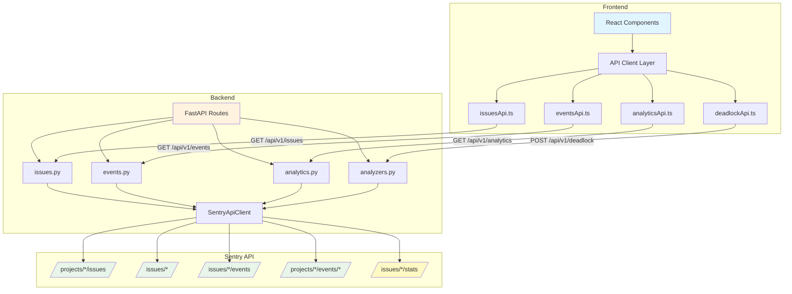
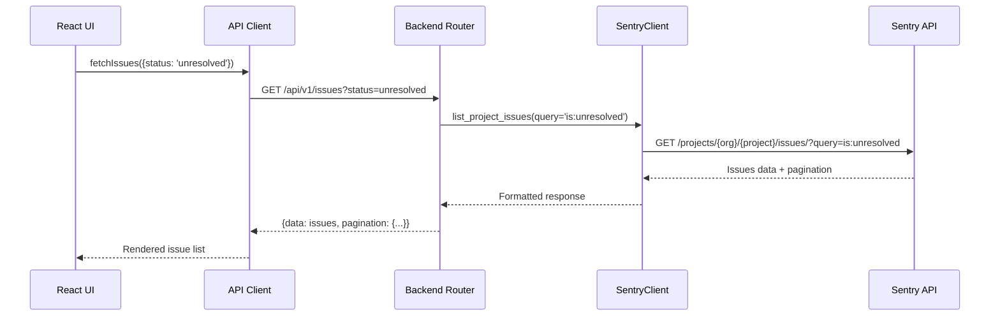
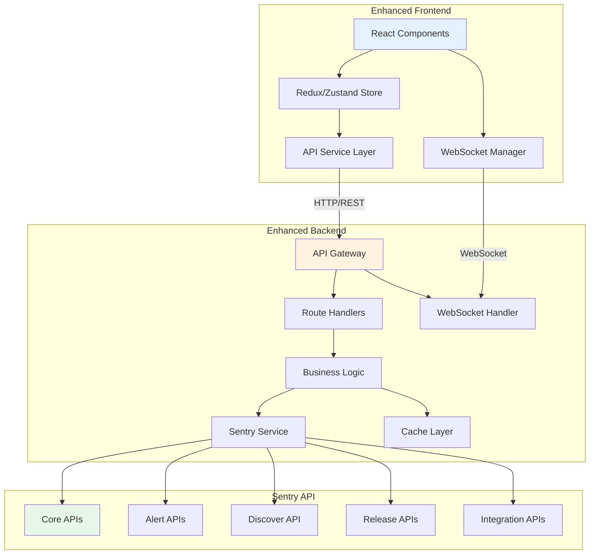
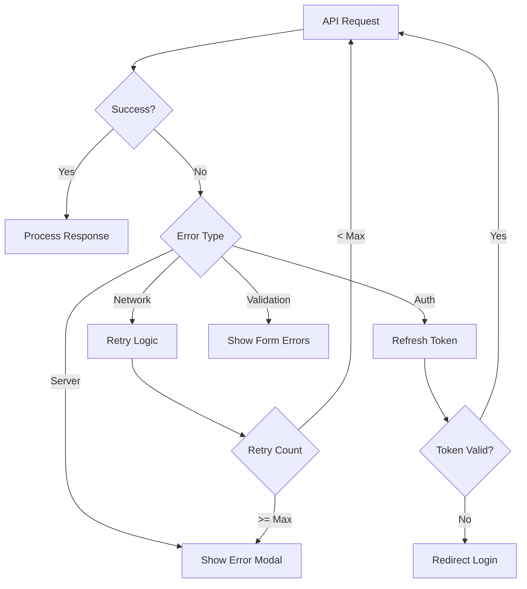

# Dexter API Flow Architecture

## Current API Flow Diagram



## API Data Flow Example: Fetching Issues



## Current Implementation Status

### ✅ Fully Implemented Flows
- Basic issue listing and filtering
- Event details retrieval
- Issue status updates
- Deadlock analysis

### ⚠️ Partially Implemented Flows
- Bulk operations (backend exists, frontend missing)
- Export functionality (backend exists, frontend missing)
- Issue statistics (works but not in Sentry spec)

### ❌ Not Implemented Flows
- Issue assignment
- Issue comments
- Issue tagging
- Issue merging
- Alert rules
- Release management
- Advanced querying (Discover API)

## Proposed Enhanced Architecture



## API Integration Patterns

### 1. Standard CRUD Pattern
```typescript
// Frontend
const resource = await api.get('/resource/{id}');
const updated = await api.put('/resource/{id}', data);
const created = await api.post('/resource', data);
await api.delete('/resource/{id}');
```

### 2. Bulk Operations Pattern
```typescript
// Frontend
const results = await api.post('/resources/bulk', {
  operation: 'update',
  ids: [1, 2, 3],
  data: { status: 'resolved' }
});
```

### 3. Streaming Data Pattern
```typescript
// Frontend WebSocket
const ws = new WebSocket('ws://api/events');
ws.onmessage = (event) => {
  const data = JSON.parse(event.data);
  updateStore(data);
};
```

### 4. Paginated Data Pattern
```typescript
// Frontend
const fetchPage = async (cursor) => {
  const response = await api.get('/resources', { cursor });
  return {
    data: response.data,
    nextCursor: response.pagination.next.cursor
  };
};
```

## Error Handling Flow



This comprehensive API flow documentation shows the current state and proposed enhancements for Dexter's integration with the Sentry API.
